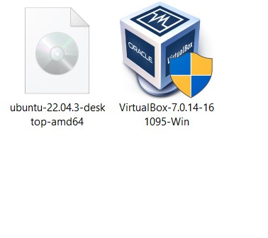

# Operating System Lab 02

## Task1

In this Lab manual I will go through the process that how to install Ubuntu setup.

1. First of all you will be given 2 files one will be of Virtual Box and other is of ISO file of Ubuntu setup. 

2. Now you will install virtual Box and for your ease don't change any default paths otherwise you will need to make changes afterward.

3. After installing virtual box you will need to select hyper V settings on your PC     
   control Panel ->programs->turn the windows feature on and off.  
   
   Make sure to select both options in Hyper V if one is disable than make sure to enable your PC Virtualization technology Enabled.
   
4. After installation of Virtual Box and settings of Virtualization Technology you will select new on the home page that is for new Machine.

   

   

5. After selecting new Machine you will select a name of your server anything of your choice.

      

6. After setting the server name you will select that ISO file provided at the start of installation and your virtual machine will auto detect that ISO file for ubuntu server.

7. After the detection of Ubuntu server your new machine will demand some name and password from you.

     

8. You will set the username and password but make it sure that you will need to remember that password for login 

9. After setting the name and password you will set the Ram and processors of your virtual machine, It is best practice to leave it as default but you can change that depending on your PC.
 

10. Now it will show you an overview of the settings for your virtual Machine                  

11. After selecting finish your installation begins automatically and if it does not start automatically than you will select that server from the side bar and click on start at the top of menu.

12. Now it will start setting up your Ubuntu software.

    
    
    
13. After that Ubuntu is installed on PC.

    

    

    

## Task 2:

I am having issues in the compilation of code.

## Task 3:

https://github.com/Ab5536/Operating_System_Lab2
